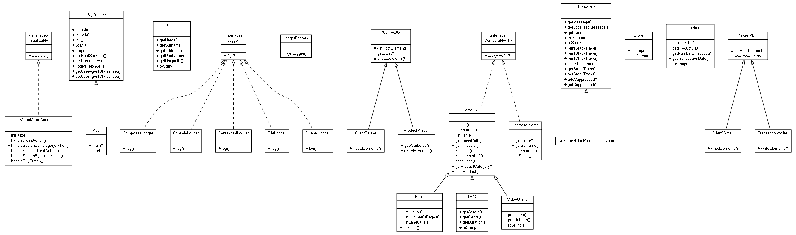
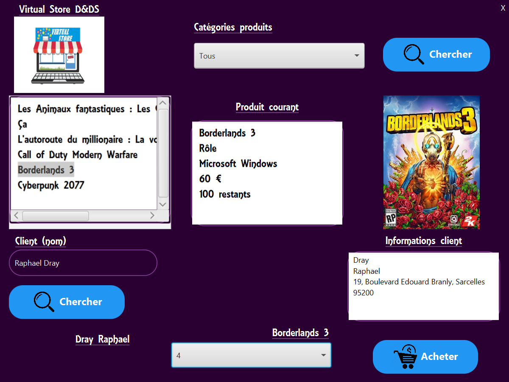

# Virtual Store
---
## Authors: Dray Raphael, De Sevin Alexandre
---
> This program is a Virtual Store.
> It can be opened in a window using **JavaFX**.

> It's written in __Java language and JavaFX library__.
> It's for an engineering school **OOP Project**.

---
### UML Diagram:

---
### Main View:
